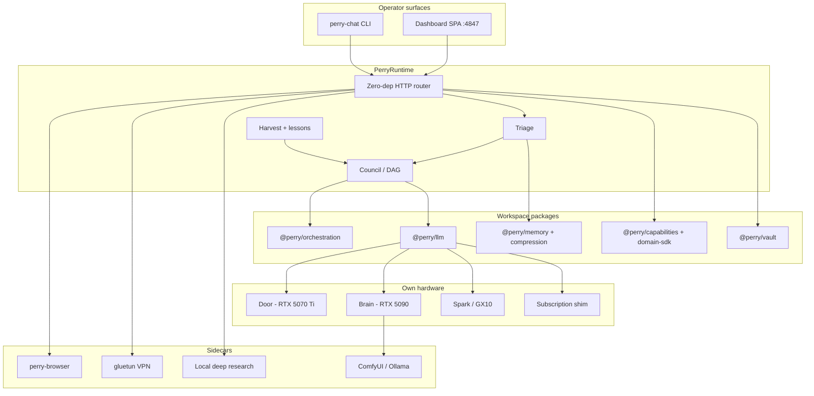

# Perry v2

**A self-hosted multi-agent platform I designed, built, and run on my own hardware.**

Perry is how I learn systems the only way that sticks: ship a version, run it for real work, write down what broke, then cut the next one. This repo is the public record of **v2** — what it is, what v1 taught me, and why I am building **v3**.

The live v1 tree is still here, untouched: [`perry-system`](https://github.com/Perry5216/perry-system).  
This repo does **not** replace it.

| Version | Repo | Role |
|---|---|---|
| **v1** | [`perry-system`](https://github.com/Perry5216/perry-system) | First public platform. Coordinator + worker pool + learning loop. Still the historical source. |
| **v2** | **this repo** | Rebuild as a typed monorepo, GPU fabric, fail-closed fleet. What I run today. |
| **v3** | in design | Same products. New agent kernel (session log + plugins) so the system is reliable enough to keep growing. |

I am a London-based developer (CS + cybersecurity). I build the stack, the orchestration, the dashboard, the GPU routing, and the learning loop — not a wrapper around one API.

---

## What an employer should take from this

I can take a vague “I want my own AI platform” and turn it into a **running system** with:

- a real package graph and composition root, not a single script
- more than one model backend, on more than one machine
- work that fans out when it is independent and stays serial when it is not
- a learning loop that is evidence-based, not “the prompt got longer”
- fail-closed gates on anything that leaves the box (mail, deploy, spend, web egress)
- tests and a deploy path I actually use

The interesting part is not any one feature. It is that **v1, v2, and v3 are the same product idea under three different architectures**, each cut because the previous one hit a wall I can name.

---

## The version story

### v1 — prove the idea (`perry-system`)

v1 answered: *can I host a multi-agent platform on my own metal, with a dashboard, a worker pool, VPN-routed research, and a learning loop?*

Yes. I shipped:

- an Express coordinator and SQLite task pool
- containerised subscription-CLI workers claiming work over MCP
- event-driven skill proposals (streak → propose → human curate)
- local Ollama + ComfyUI, LoRA training, FTS5 + embeddings RAG
- a novel-writing pipeline as the first domain
- gluetun VPN exits for scouting

**What I learned the hard way**

- “Domain-agnostic platform” was the right bet. The novel pipeline was a *domain*, not the product.
- A single Express app plus SQLite as the nervous system does not stay honest once you have books, research, coding agents, and a dashboard all mutating the same tables.
- Learning that writes files the next worker *might* load is not the same as learning the model *did* see.
- Subscription CLIs are a cost model, not an architecture. The platform has to own routing, or one dead vendor lane takes the house down.

v1 stays public as the first cut. I am not rewriting history over it.

### v2 — rebuild the system (this repo)

v2 answered: *can I make this a real fleet, with seams, instead of one coordinator that knows everything?*

I threw away the v1 package layout (`core`, `dashboard-api`, `projects`) on purpose. Those folders are tombstones in the private tree. The running system is **18 TypeScript workspaces** under `app/perry/packages`, composed by `PerryRuntime`, served by a zero-dependency HTTP server on `:4847`.

What v2 added that v1 could not carry:

| Area | What I built |
|---|---|
| **Package graph** | Foundation (`types`, `mcp-core`, `node-limiter`) → orchestration → intelligence (LLM, memory, compression, canon, code-intel) → multimodal + vault → bootstrap + dashboard |
| **Orchestration** | `runPipeline`, `runFanout`, `CouncilOrchestrator`, `runJobGraph` (DAG, Kahn-validated, per-backend gates, resume-by-seed) |
| **Compute fabric** | Node-aware seats: Door (RTX 5070 Ti), Brain (RTX 5090), Spark/GX10 (resident large models), plus subscription shims. Circuit breakers per backend. |
| **Fail-closed** | Outward actions park for approval. Uncertain gates report non-green. Harvest that scanned nothing is a failure, not a success. |
| **Book engine** | Plan → outline → bibles → chapters → edit. Deep mode locks seam contracts so chapters can swarm on the DAG. “Eyes” tickets lift prose; the weak writer does not retry what it failed. |
| **Coding council** | `PLAN → CONSENSUS → BUILD → VERIFY` with a deterministic code-intel gate *and* a semantic judge. |
| **Research + VPN** | Local deep-research sidecar (honest error if it is down). `NetworkClient` proxies only web egress through gluetun, multi-exit round-robin + stealth UAs. Models and the API stay direct. |
| **Browser** | Cursor-style sidecar (`session / act / snapshot / pick / console / network`) so an agent and I can share a live page. |
| **Learning** | Journal harvest clusters ticket ledgers into standing rules with counts. Lessons inject into later jobs. Souls change lessons fast and persona slow. Shared lessons become abilities. |
| **Extension seams** | Domains, `tools.json` (http / mcp / cli / fs), capability bridge, signed marketplace. New behaviour is supposed to register, not patch the runtime. |

**What I learned running v2**

- Seams and a GPU fabric fixed *scale*. They did not fix *reliability of the agent*.
- I ended up with **several loops** (chat, OpenCode, Aider, council-build) and **several histories** (JSONL chat, task transcripts, SSE, browser acts). After a crash I could not answer “what did the model actually see?”
- `PerryRuntime` became the god object again — the thing v1’s coordinator had been. Plugins at the edges do not help if the loop is sacred.
- Harvest can write a standing rule that the next lane never receives. If injection is not a logged fact, “the system learns” is a story, not a property.
- Browser, VPN, and research are good products. They are bad special cases inside the chat path.

That is the brief for v3. Not “more features.” **One spine.**

### v3 — same Perry, reliable kernel (in design)

v3 keeps every v2 product: VPN, local deep research, books, email gates, board, fleet, harvest, browser, lab sidecars, voice, vision.

What changes is the agent kernel:

1. **Append-only session log.** Anything the model sees is reconstructable from the log. Mismatch is a hard error. Resume / fork / replay are log operations.
2. **One loop, many providers.** GPU seats, browser, sandbox, MCP tools hang off documented events (`pre-step`, `request`, `tools/pre-execute`). New behaviour mounts; the loop stays thin.
3. **Learning is injection you can prove.** Harvest still clusters evidence (now including the session log). The next turn *logs* the inject. `minimal` profile turns costume off so I can tell model vs harness.
4. **Vendored harness as kernel, Perry as bundle + sidecars.** I am not deleting the book engine into a plugin. Books, LDR, gluetun, and the GPU steward stay processes. Thin plugins call them and write the log.

v3 exists because v2 taught me the next failure mode: **a fleet without a single source of truth will keep growing and keep lying about what happened.**

---

## Architecture (v2, as run)

**Design rules I hold the code to**

- **Self-hosted and private by default.** Local GPUs run the models. Nothing leaves the box unless I mount a cloud backend or turn on web egress.
- **Fail-closed.** If the gate is uncertain, the result is not green.
- **Node-aware.** A new machine is a config line, not a rewrite.
- **Parallel only on real dependencies.** The DAG rejects cycles up front.
- **Learning needs evidence.** Harvest is fail-closed if it scanned nothing. Rules carry counts.

---

## What v2 actually does

These are running subsystems, not a roadmap.

- **Chat and tools** — agentic and grounded modes, think-out-loud, fleet council across seats
- **Tasks / board / autopilot** — tickets with ledgers, approval parks, cron
- **Books** — full novelist pipeline, eyes, swarm, KDP gate
- **Research** — local deep-research sidecar; no silent web fallback
- **VPN / stealth** — optional, web-only, multi-exit, persisted in `network.json`
- **Memory / recall / librarian** — markdown vault + Qdrant/file recall + budgeted compression
- **Email** — poll and draft; send only after explicit approve
- **Creative GPUs** — ComfyUI / Blender 3D and 2D, covers
- **Dev shop** — Forgejo, code-server, OpenCode/grok lane, worker pool
- **Learning** — harvest → standing rules → inject; souls + abilities

---

## Stack

- TypeScript, Node ≥ 22, ESM, `tsc --build` project references
- ~18 `@perry/*` workspaces
- Docker Compose for the stack; overlays for GPU / IDE / Forgejo / browser
- React dashboard
- Ollama / vLLM / OpenAI-compatible shims
- Playwright browser sidecar
- Tests next to code; bootstrap suite on the order of hundreds of cases

The **live application and operator data stay private**. This public repo is the architecture, the version history, and the design record — the part a hiring manager can read in ten minutes and verify against [`perry-system`](https://github.com/Perry5216/perry-system) (v1 source) and the write-ups in [`docs/`](docs/).

---

## Why not just keep growing v2?

Because I already did, and I can point at the failure:

| Symptom in v2 | What it costs | v3 move |
|---|---|---|
| Several agent loops | “It worked in chat / failed in OpenCode” | One `Agent` interface, lanes are providers |
| Several histories | Cannot resume what the model saw | Session log is the only context source |
| Harvest file vs next prompt | Fake learning | Logged `pre-step` inject |
| Runtime knows too much | Every feature patches the centre | Thin loop + sidecar products |
| No “bare model” mode | Cannot tell weights from costume | `minimal` profile |

v3 is a reliability cut, not a feature reboot. If a v2 capability cannot come across as a sidecar or a plugin, the cut is not done.

---

## Status

- **v1** — public, frozen as the first platform: [`perry-system`](https://github.com/Perry5216/perry-system)
- **v2** — private production system on my LAN; this repo is the public map
- **v3** — design in progress (vendored agent kernel, Perry bundle, full v2 surface including VPN, research, and learning)

I would rather show three honest versions than one repo that pretends the first design was the last one.

---

## License

Documentation in this repository is provided for portfolio and educational use. The running v2/v3 source and operator data are not published here.

v1 source remains under the license on [`perry-system`](https://github.com/Perry5216/perry-system).
